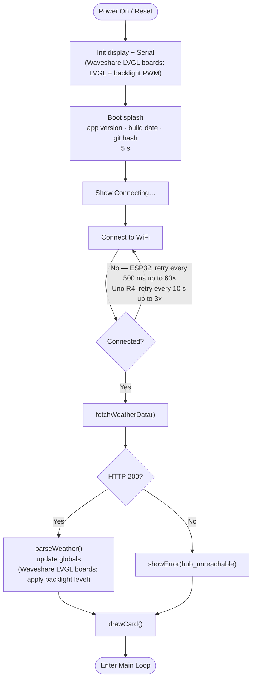
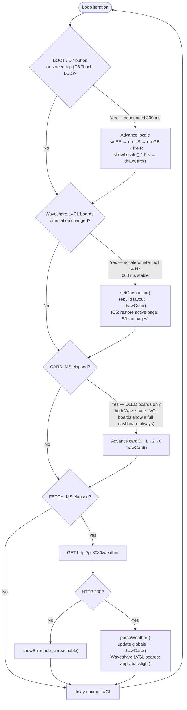
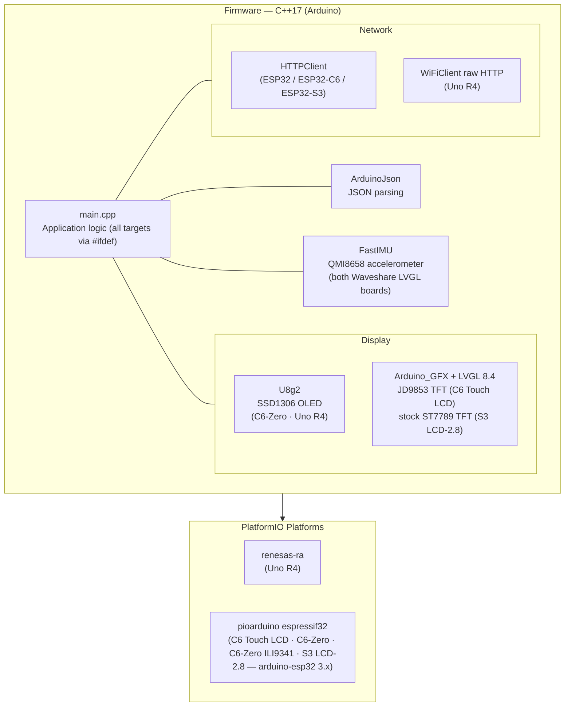
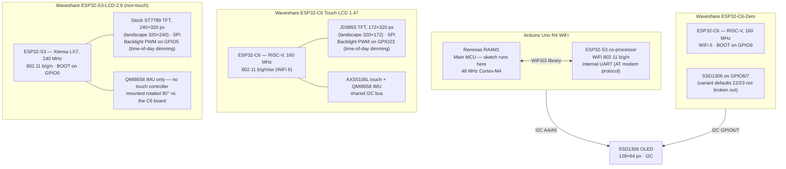

# Firmware Architecture

Device-side architecture for the display clients. The server/system-level view (Netatmo → Pi proxy → devices, token refresh, proxy internals) lives in the hub repo: [netatmo-home-hub/docs/architecture.md](https://github.com/vcchstrandberg/netatmo-home-hub/blob/main/docs/architecture.md).

All targets share one `src/main.cpp`, branching by build-flag `#ifdef`. Devices call the Pi's `GET /weather` over plain HTTP and render the flat JSON — no TLS, no OAuth, no tokens on the device.

---

## Boot Sequence

---

## Main Loop

**Timing by board:**

| Board | Card rotation (CARD_MS) | Fetch interval (FETCH_MS) |
|---|---|---|
| ESP32-C6-Zero | 5 s | 5 min |
| Uno R4 WiFi | 5 s | 60 s |
| Waveshare ESP32-C6 Touch LCD | Never — full dashboard | 5 min |
| Waveshare ESP32-S3-LCD-2.8 | Never — full dashboard | 5 min |

The Uno R4 fetches more frequently because its WiFi module (ESP32-S3 co-processor) keeps the connection open; the ESP32 boards use the same always-on polling approach at a slower rate to reduce Netatmo API load. Both Waveshare LVGL boards show their full dashboard at once, so neither rotates cards.

---

## Software Stack

All four ESP32 targets are pinned to the same pioarduino platform release (an unpinned `platform = espressif32` was found to resolve inconsistently between a machine with an existing package cache and a from-scratch CI runner — see `docs/production-readiness.md`'s CI section); the two LVGL boards (C6 Touch LCD, S3 LCD-2.8) additionally pull in Arduino_GFX, LVGL and FastIMU for their integrated panel and accelerometer — the C6 additionally uses the AXS5106L touch driver, which the S3 board doesn't have.

---

## Hardware Overview

The Waveshare ESP32-C6 Touch LCD uses a JD9853 panel (not stock ST7789) that needs a custom register init before its backlight regulator turns on — see [wiring.md](wiring.md) and the display driver in `src/lvgl_ui.cpp`. The ESP32-S3-LCD-2.8 uses a stock ST7789 instead, so Arduino_GFX's built-in init is enough — see `src/lvgl_ui_s3.cpp`. Both boards' backlights run on LEDC PWM so the hub can drive time-of-day dimming.
